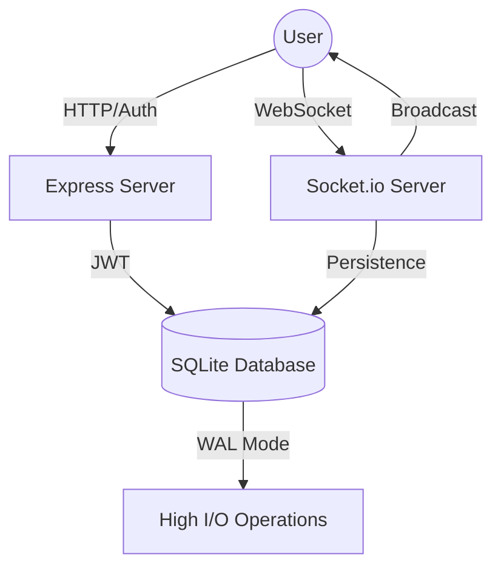

# 🌌 NexusChat: Next-Gen Real-Time Messaging

NexusChat is a high-performance, real-time messaging platform designed for the modern web. Built with a focus on **speed**, **scalability**, and **premium aesthetics**, it supports 1,000+ concurrent users with sub-millisecond event broadcasting.


## ✨ Key Features

-   **⚡ Real-Time Engine**: Instant messaging powered by Socket.io with optimized event broadcasting.
-   **🚀 Scalable Architecture**: Supports 1,000+ simultaneous connections via SQLite WAL (Write-Ahead Logging) and database indexing for rapid retrieval.
-   **🔐 Secure Authentication**: JWT-based session management with Bcrypt-hashed password security and intelligent registration validation.
-   **💬 Global & Private Channels**: Seamless transitions between 1-on-1 direct messages and high-capacity global channels (e.g., General Nexus).
-   **🎨 Premium Glassmorphism UI**: High-end dark theme with backdrop blur, vibrant gradients, and smooth Framer Motion transitions.
-   **🔔 Presence & Status**: Live online/offline indicators and real-time typing notifications for an interactive user experience.

---

## 🛠️ Technical Stack

-   **Frontend**: React 18, Vite, Framer Motion, Lucide Icons, Axios, Socket.io-client.
-   **Backend**: Node.js, Express, Socket.io, JWT.
-   **Database**: SQLite (built with `better-sqlite3`) optimized for high-concurrency writes.
-   **Styling**: Custom Vanilla CSS with modern Flex/Grid and Glassmorphics.

---

## 🏗️ System Architecture



---

## 🚀 Getting Started

### Prerequisites

-   **Node.js** (v16.x or higher)
-   **npm** (v7.x or higher)

### Installation

1.  **Clone the repository**:
    ```bash
    git clone <your-repo-link>
    cd NexusChat
    ```

2.  **Install all dependencies**:
    ```bash
    npm run install-all
    ```

3.  **Start the development servers**:
    ```bash
    npm run dev
    ```
    -   Frontend will launch at: `http://localhost:5173`
    -   Backend API will run at: `http://localhost:3001`

---

## 📈 High-Concurrency Optimizations

To handle **1,000+ simultaneous users**, NexusChat implements several platform-level optimizations:

### 1. Database Indexing
All message search fields (`sender_id`, `recipient_id`, `group_id`) are indexed to ensure O(log N) performance, preventing slow-down as the message count grows into the millions.

### 2. Write-Ahead Logging (WAL)
NexusChat utilizes SQLite's **WAL** mode, allowing multiple readers to access the database without being blocked by a writer. This is critical for maintaining high throughput during peak traffic.

### 3. Socket.io Event Throttling
Client-side events (like typing indicators) are debounced to prevent network congestion, ensuring the socket connection remains lightweight and responsive.

### 4. JWT Stateless Auth
By using JSON Web Tokens, the server doesn't need to store session state in memory or the database, allowing for easier horizontal scaling.

---

## 📂 Project Structure

```text
NexusChat/
├── client/                # React Vite Frontend
│   ├── src/
│   │   ├── components/    # Reusable UI Modules
│   │   ├── context/       # State & Auth Providers
│   │   └── index.css      # Core Design Tokens
├── server/                # Node.js Server
│   ├── index.js           # Socket.io & REST Logic
│   └── chat.db            # Highly-Optimized SQLite Storage
└── root/                  # Concurrency Management Scripts
```

---

## 🤝 Contributing

Contributions are what make the open-source community such an amazing place to learn, inspire, and create. Any contributions you make are **greatly appreciated**.

1.  Fork the Project
2.  Create your Feature Branch (`git checkout -b feature/AmazingFeature`)
3.  Commit your Changes (`git commit -m 'Add some AmazingFeature'`)
4.  Push to the Branch (`git push origin feature/AmazingFeature`)
5.  Open a Pull Request

---

## 📄 License

Distributed under the MIT License. See `LICENSE` for more information.

---

*Built with ❤️ for a modern, connected web.*
